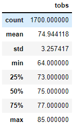
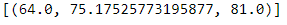
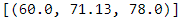

# Surf's Up Advanced Data Storage and Retrieval

## Overview of the analysis
This project uses Python, SQLAlchemy, and Flask to analyze climate data and get information on temperature trends to support decision making before investing in a surf shop in Oahu.  Of interest are the temperature data for the months of June and December to help determine if the surf and ice cream shop business is sustainable year-round.
<br />

The two technical analysis deliverables required to complete weather data analysis include <br />

1. Determine the Summary Statistics for June
2. Determine the Summary Statistics for December

## Resources
- Data Source: This analysis was performed using the [hawaii.sqlite](https://github.com/aobasuyi/Surfs_up/blob/main/hawaii.sqlite) dataset.
- Software: Python 3.7.6 :: Anaconda, Inc., conda 4.10.1, Jupyter-notebook : 6.1.4, Visual Studio Code, 1.56

## Results
The key differences in weather data between the months of June and December are shown below <br />

**Comparison summary statistics for June and December** <br />
The results dataframes show the summary of different statistics for the temperature for the months of June and December. 
- The month of June has more observations of tempearture data compared to December.
- The  average temperature in June is higher with a lower spread out of numbers in the dataset.
- The median temparature in December is 71 degrees.

| Summary Statistics for June | Summary Statistics for December |
| ------------- | ------------- |
|   |   |


**Additional queries to gather more weather data for June and December**

- To write a function that will accept start date and end date,  and return the minimum, average, and maximum temperatures for that range of dates for June 2016.

```
def calc_temps(start_date, end_date):
    c_results = session.query(func.min(Measurement.tobs), func.avg(Measurement.tobs), func.max(Measurement.tobs)).\
                    filter(Measurement.date >= start_date).\
                    filter(Measurement.date <= end_date).all()
    return c_results
calc_temps('2016-06-01', '2016-06-31')

```
- Using the function to to calculate the minimum, average and maximum tempeature in December 
```
trip_results = calc_temps('2016-12-01', '2016-12-31')
trip_results
```
| June 2016 | December 2016|
| ------------- | ------------- |
|   |   |

## Summary
- The temperature trends in Oahu show it will be a great location for a surf and ice cream shop business 
- The mean temperature is 75 degrees for the month of June and 71 degrees for December. 
- Two additional queries result for June and December 2016 show that tempearture trends for 2016 follows the avearge, minimum and maximum temparatures for the two months.

