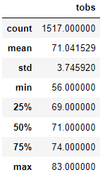

# Surf's Up Advanced Data Storage and Retrieval

## Overview of the analysis
This project analyzes a weather dataset to get information on temperature trends in Oahu. The result of the analysis will support decision making for investing in a surf shop in this location.  Of interest are the temperature data for the months of June and December to help determine if the surf and ice cream shop business is sustainable year-round.
<br />

The two technical analysis deliverables required to complete weather data analysis include: <br />

1. Determine the Summary Statistics for June
2. Determine the Summary Statistics for December

## Resources
- Data Source: This analysis was performed using the [hawaii.sqlite](https://github.com/aobasuyi/Surfs_up/blob/main/hawaii.sqlite) dataset.
- Software: Python 3.7.6 :: Anaconda, Inc., conda 4.10.1, Jupyter-notebook : 6.1.4, Visual Studio Code, 1.56

## Results
A.  **Comparison summary statistics for June and December:** <br />

The key differences in weather data between the months of June and December are shown below <br />

- There are more observations of the temperature data for month of June compared to month of December.
- The  average temperature and the standard deviation lower for the month of June.
- The median temparature in December is 71 degrees and that of June is 75 degrees.

| Summary Statistics for June | Summary Statistics for December |
| ------------- | ------------- |
|   |   |


B.  **Additional queries to gather more weather data for June and December**

- A function that will accept the start and the end dates, and return the minimum, average, and maximum temperatures for that range of dates for June 2016 is shown below.

```
def calc_temps(start_date, end_date):
    c_results = session.query(func.min(Measurement.tobs), func.avg(Measurement.tobs), func.max(Measurement.tobs)).\
                    filter(Measurement.date >= start_date).\
                    filter(Measurement.date <= end_date).all()
    return c_results
calc_temps('2016-06-01', '2016-06-31')

```
- Using the same function to calculate the minimum, average and maximum tempeature for December 2016 as well,
```
trip_results = calc_temps('2016-12-01', '2016-12-31')
trip_results
```

| June 2016 | December 2016|
| ------------- | ------------- |
|   |   |

## Summary
- The temperature trends in Oahu show it will be a great location for a surf and ice cream shop business.
- The mean temperature is 75 degrees for the month of June and 71 degrees for December. 
- The two additional queries result show that temperature trends for June and December 2016 follow the average, minimum and maximum temperatures as shown in summary statistics result tables.
